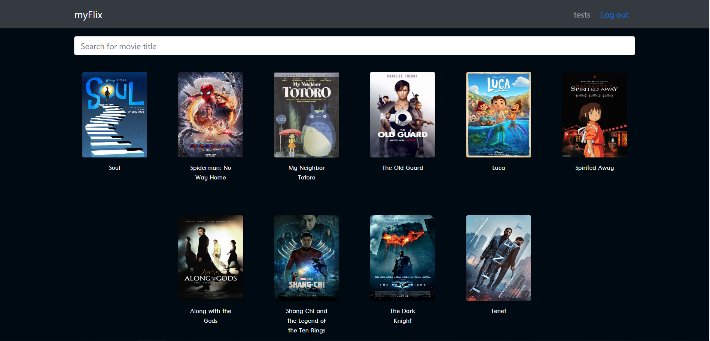

## myFlix Movie App
This movie app was created using the MERN tech stack (MongoDB, Express, React, and Node.js). Currently, I am working on the client-side of the application which will include several interface views built using the React library that will handle data through my REST API endpoints.

Use the following terminal command to run the app on http://localhost:1234

`parcel src/index.html`

## Description
Using React, I built the client-side for a movie application called myFlix based on its existing server-side code (REST API and database).

## Link