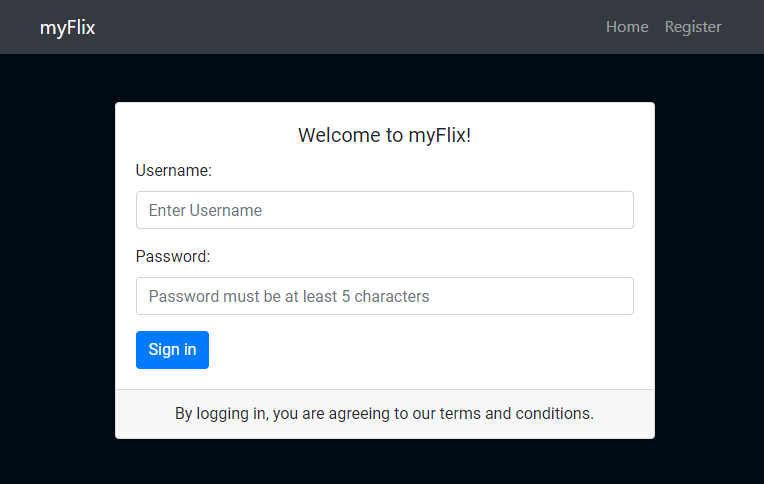
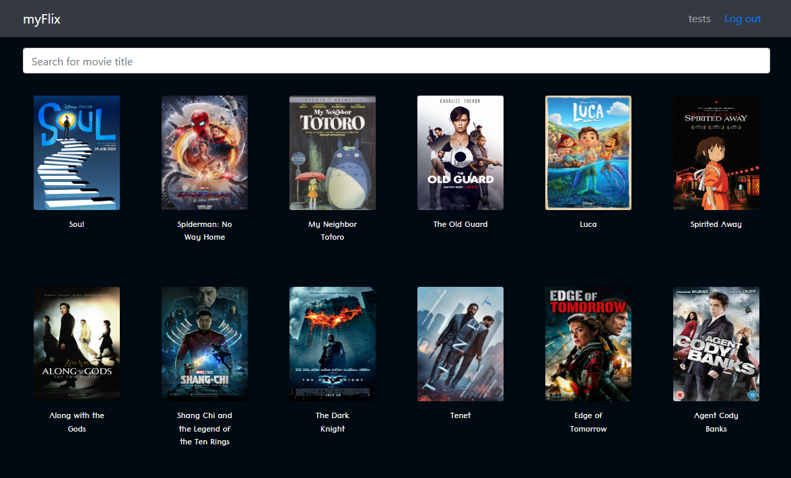
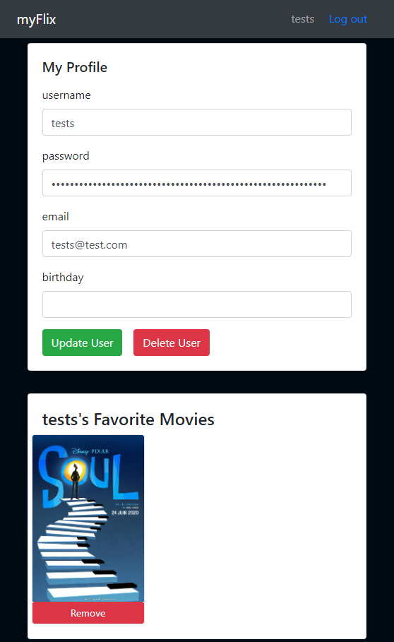
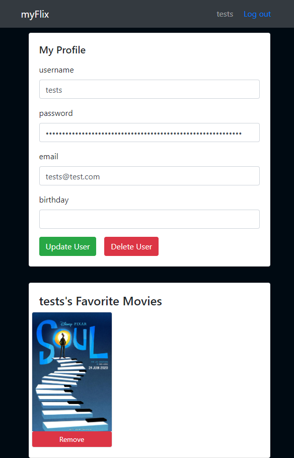

## myFlix Movie App
This movie app was created using the MERN tech stack (MongoDB, Express, React, and Node.js). Using React, I built the client-side for a movie application called myFlix based on its existing server-side code (REST API and database).

 

Use the following terminal command to run the app on http://localhost:1234

`npm start`

## Link

https://gracean-myflix.netlify.app/
