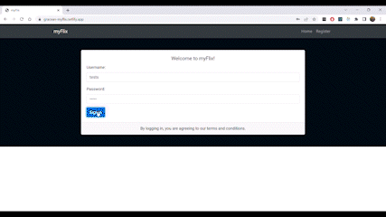

## myFlix Movie App
This movie app was created using the MERN tech stack (MongoDB, Express, React, and Node.js). Using React, I built the client-side for a movie application called myFlix based on my existing server-side code (REST API and database), which can be accessed using the following link:

https://github.com/gracesuhyun/myFlix-API



## Instructions
1. In order to run this application, you will need to make sure you have a recent version of Node.js on your PC. 
2. Then you can clone this repository, open the project's root folder using your preferred IDE and install all the dependencies listed in the "package.json" file by running `npm install` in the terminal. 
3. Finally, launch the app locally using `npm start` in the terminal and then go to http://localhost:1234

## Dependencies
```
"dependencies": {
    "axios": "^0.27.2",
    "bootstrap": "^5.2.0",
    "parcel": "^2.7.0",
    "prop-types": "^15.8.1",
    "react": "^18.2.0",
    "react-bootstrap": "^2.7.0",
    "react-dom": "^18.2.0",
    "react-redux": "^8.0.2",
    "react-router-dom": "^5.3.0",
    "redux": "^4.2.0",
    "redux-devtools-extension": "^2.13.9"
},
"devDependencies": {
    "@babel/generator": "^7.18.2",
    "@babel/parser": "^7.18.5",
    "@babel/traverse": "^7.18.5",
    "@parcel/transformer-sass": "^2.7.0",
    "buffer": "^6.0.3",
    "process": "^0.11.10"
}
```

## Project Link
https://gracean-myflix.netlify.app/
